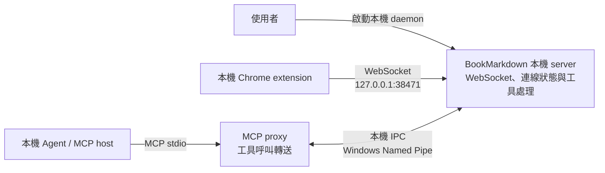

## 狀態

本 repository 已實作 daemon 與 MCP stdio proxy 的程序拆分。使用者手動以前景程序啟動 daemon；MCP host 啟動 proxy，並透過本機 IPC 將工具呼叫交給 daemon。此 repository 的 Node.js 測試不代表真實 Chrome、extension 或指定 MCP host 的整合已驗證。

## 架構圖

Daemon 僅在使用者需要時執行。MCP host 啟動 proxy；proxy 即使 daemon 離線仍可提供 MCP initialize 與工具清單，並在工具呼叫時檢查 daemon 和 extension 狀態。Proxy 不持有 extension 連線或業務狀態。

## 本機 CLI 子命令

同一個 npm package 使用單一 CLI binary，透過 `daemon` 與 `proxy` 子命令啟動本機 server 和 MCP proxy。`npm start -- daemon`、`node dist/cli.js daemon` 與套件 CLI 預設使用正式模式；正式模式要求 `BOOKMARKDOWN_EXTENSION_IDS`。`npm run dev -- daemon` 透過明確的 development entrypoint 啟動開發模式，不需要固定 extension ID 清單，也不依 `NODE_ENV` 判斷模式。兩種模式都要求 `BOOKMARKDOWN_BRIDGE_TOKEN`，並可設定 `BOOKMARKDOWN_WS_PORT`。proxy 可連線至任一 daemon mode。

## 程序責任

* Daemon 維護 WebSocket listener、已認證的 extension connections、request routing、MCP tools 的實際處理，以及 process-local 的連線狀態。狀態不落盤；daemon 重啟後由 extension 重連並重新註冊。
* Proxy 提供 MCP stdio endpoint，使用 package 共用的靜態 tool schema 回應 initialize 與 tools/list；tools/call 透過 IPC 交給 daemon 執行。Proxy 不執行 browser 業務邏輯，也不會啟動 daemon。
* 每個 proxy session 維持一條 IPC 長連線，同一 daemon 可同時接受多個 proxy。IPC 協定須定義 framing、schema、session/request ID 關聯、取消、逾時、斷線處理和 payload 上限。
* Windows MVP 使用 Named Pipe 作為 daemon 與本機 proxy 間的 IPC；同一 daemon 可服務多個 proxy session。

目前 browser RPC 僅允許計數、分頁 metadata 清單、開啟、關閉與跨視窗移動分頁。Extension 必須依 capabilities 回應，並在計數與清單中排除 incognito 視窗和分頁。標題與 URL 是敏感 metadata；不提供頁面內容。開啟、關閉與移動的結果不明時不得自動重送。

## 啟動生命週期

1. 使用者設定 daemon 環境變數並手動執行 `daemon` 子命令。正式模式驗證配對 token 與精確 extension ID allowlist；開發模式驗證配對 token，不要求固定 ID 清單。Daemon 維持 `127.0.0.1` WebSocket 綁定並啟動 IPC；若設定錯誤或 listener 啟動失敗，整體啟動失敗並以非零狀態退出，不留下半啟動 endpoint，也不掃描其他 port。
2. 符合目前協定的 extension client 可連線至 daemon WebSocket listener。Companion extension 已實作網路錯誤後的退避重連與重新註冊；此行為由 extension 負責，不在此 repository 實作。重連退避尚無專項自動化測試，真實 Chrome 中的重連也尚未驗證。
3. MCP host 啟動 `proxy` 子命令。Proxy 使用共用 schema 回應 MCP initialize 與 tools/list，並透過 IPC health check 分開取得 daemon readiness 和 extension connection 狀態。
4. 若 daemon 離線，MCP stdio 和工具清單仍可用；tools/call 回 `DAEMON_UNAVAILABLE`。Proxy 不啟動 daemon，後續工具呼叫會重新探測並嘗試連線，因此使用者啟動 daemon 後不必重啟 proxy。
5. Daemon ready 但 extension 未連線時，tools/call 立即回 `EXTENSION_NOT_CONNECTED`，不等待 extension。若 extension 已連線但未回覆，沿用設定的 request timeout。
6. 若 daemon 在工具呼叫途中中斷，該呼叫回 `DAEMON_DISCONNECTED`，不自動重送；後續呼叫重新連線。
7. 使用者按 `Ctrl+C` 停止 daemon 時，daemon 停止接收新 IPC 請求，有限時間清理在途呼叫，逾時則以 `DAEMON_DISCONNECTED` 結束並關閉 WebSocket 和 IPC。
8. 再次執行 daemon 時，CLI 先探測既有 instance。IPC health 包含 runtime mode；只有健康、版本相同且 runtime mode 相同的既有 daemon 才會被視為重複啟動。其他模式不會被當成相符的 duplicate，若共用 listener 已占用，新的啟動會失敗。環境變數變更需由使用者停止並重新啟動 daemon 才會生效。
9. Proxy 與 daemon 以 IPC handshake 比對 package version。版本不符時回 `DAEMON_VERSION_MISMATCH`，提示使用者手動重啟 daemon；proxy 不代為重啟。

## 安全邊界

* WebSocket 維持 `127.0.0.1` 綁定。兩種模式都只接受格式為 `chrome-extension://[a-p]{32}` 的 Origin，要求 pairing token，並驗證 hello extension ID 與 Origin ID 完全相同。
* 正式模式另外要求 extension ID 精確符合 `BOOKMARKDOWN_EXTENSION_IDS`；開發模式不使用固定 allowlist。Origin 不是認證。
* WebSocket pairing token 只由 daemon 透過環境變數讀取，不得放入命令列、log、proxy 環境或 MCP 回覆。
* Proxy 透過本機 IPC 呼叫 daemon；WebSocket pairing token 不經過 proxy。
* Browser RPC 使用明確 operation allowlist、每項操作的 strict payload/result schemas 與 instance capability 檢查。不得記錄 tab URL、標題或 operation payload。
* Daemon 必須限制連線數、訊息大小、pending requests 和等待時間；斷線或取消時清除對應狀態。
* Proxy 不可在 daemon 不可用時自行啟動 daemon、連線到其他 endpoint，或自動重送結果不明的請求。

## 實作與驗證

daemon/proxy 拆分、Windows Named Pipe IPC、health/version handshake、共用工具目錄與 CLI 子命令已實作於此 repository。一般 Node.js 測試涵蓋本機 IPC、WebSocket 認證與 proxy 行為；companion extension 的單元測試涵蓋 handshake、probe 和 browser operations。這些測試不代表真實 Chrome/extension、Chrome Local Network Access、extension 權限或指定 MCP host 的互通性已驗證。Companion extension 的重連實作在本 repository 範圍之外，且尚無重連退避專項測試。