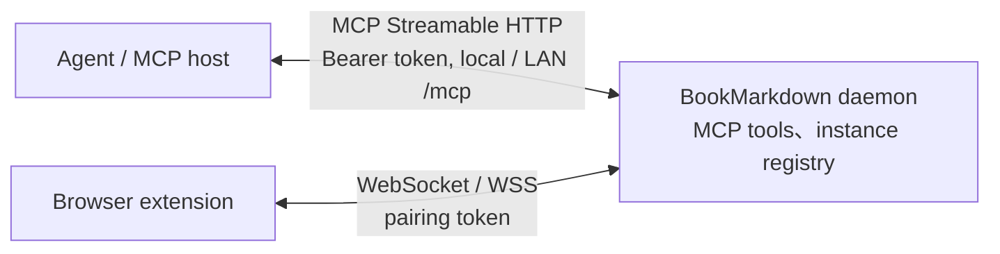

## 資料流

使用者啟動單一 daemon；agent 直接呼叫 HTTP endpoint。stdio proxy 與本機 IPC 已移除。Daemon 擁有 WebSocket listener、extension 連線、工具執行與記憶體內 instance registry；重啟後 registry 清空，由 extension 重連並重新註冊。

## HTTP transport

預設 endpoint 為 `http://127.0.0.1:38472/mcp`，port 由 `BOOKMARKDOWN_MCP_PORT` 設定。HTTP 預設綁定 loopback；設定頁開啟區網後 HTTP／WS 綁定 IPv4 interfaces，不要求 TLS。管理頁仍限 loopback。每個請求必須提供 `Authorization: Bearer <BOOKMARKDOWN_MCP_TOKEN>`；MCP token 與 extension pairing token 各自設定。

使用 SDK `NodeStreamableHTTPServerTransport`，每個 POST 建立獨立 MCP server 與 transport，工具執行共用 daemon bridge，避免不同 client 的 request ID 或協定狀態混用。無狀態模式不建立 `Mcp-Session-Id`，使用 JSON 回覆；notifications/initialized 回 `202`。非 POST 方法回 `405`，不支援 GET SSE 通知串流或 resumability。MCP negotiation、Accept/Content-Type、JSON-RPC parsing 與 protocol header validation 由 SDK 處理。

HTTP body 上限沿用 `BOOKMARKDOWN_MAX_PAYLOAD_BYTES`，超限回 `413`。同時處理中的 HTTP 請求數沿用 `BOOKMARKDOWN_MAX_PENDING_REQUESTS`，超限或正在關閉時回 `503`。Bridge 另行限制 WebSocket 連線、instances 與 in-flight browser RPC；工具逾時沿用 `BOOKMARKDOWN_REQUEST_TIMEOUT_MS`。

## 多 agent 請求配對與共享狀態

Daemon 未實作 agent 數量配額或持久的 agent session。所有 agent 共用 HTTP 處理額度，`BOOKMARKDOWN_MAX_PENDING_REQUESTS` 預設為 `32`，可設定 `1–256`；修改後需重啟 daemon。額度包含正在處理的 initialize、tools/list、tools/call 與其他已接受的 POST。閒置 agent 不占用此額度，超限回 HTTP `503` 與 `Retry-After: 1`。實際可服務的 agent 數仍取決於系統資源與呼叫頻率。

Bridge 另行以相同設定限制 pending browser RPC；這是另一個計數器，超限回工具錯誤 `BRIDGE_BUSY`。單次 devices.list 在查詢多個 instance 分頁數時，可能產生多個 browser RPC。`BOOKMARKDOWN_MAX_CONNECTIONS` 預設 `8`、範圍 `1–64`，用於 extension WebSocket 連線上限，並非 agent 數量上限。

兩層 ID 分別由 MCP client 與 daemon 管理：

| 層級 | ID 與配對方式 |
| --- | --- |
| Agent → HTTP MCP | Agent 提供 JSON-RPC `id`；每個 HTTP 請求有獨立 MCP server／transport，回覆使用原始 `id` 與 HTTP response。不同 agent 可同時使用 `id: 1`。 |
| Daemon → extension WebSocket | `RequestRouter` 為每個 browser RPC 產生 UUID `requestId`，保存該呼叫的 resolve/reject、operation 與 `connectionId`；extension 沿用 UUID 回覆。 |

例如 A 與 B 都送出 MCP `id: 1`，daemon 的 browser RPC 分別使用 UUID A 與 UUID B。即使 B 的 WebSocket 回覆先到，router 也只完成 UUID B 對應的呼叫，結果由 B 原本的 HTTP response 回傳；agent 不直接接收或篩選 extension WebSocket 訊息。

`RequestRouter.handleResponse()` 同時驗證 `requestId` 與來源 `connectionId`。來自其他 extension socket、未知 ID，或取消／逾時後才抵達的回覆會被忽略。HTTP 斷線只取消該 HTTP 請求的 bridge 等待，不會取消其他 agent 的 HTTP 請求；extension socket 中斷則會使所有等待該 socket 回覆的 browser RPC 失敗。實作見 [daemon service](../src/daemon/service.ts) 與 [request router](../src/bridge/request-router.ts)。

所有 agent 共用 MCP token、instance registry 與工具權限，未提供每個 agent 的身分／權限隔離、分頁獨占、交易或跨 agent 操作順序保證。回覆正確配對不代表瀏覽器狀態互相隔離；兩個 agent 同時修改同一分頁仍可能互相影響，衝突操作應由 agent／host 協調，結果不明時不自動重送。

## 設定與管理頁

設定檔跨重啟保存；instance registry 只在記憶體。網頁保存設定或重建 token 後，服務繼續使用原設定直到重啟；連線卡片與複製按鈕只提供執行中憑證，並標示待生效角色。管理頁瀏覽器保留不含 token 的更新客戶端提醒，重啟後由使用者確認；不是持久的 server 客戶端確認 registry。

管理頁通常只讀取已知裝置狀態；使用者明確觸發三段健康檢查時，daemon 以執行中 HTTP endpoint／token 執行 initialize、tools/list 與選定線上裝置的 `browser.countOpenTabs`。六秒總逾時，沿用本機 Host／Origin／CSRF 保護；不讀頁面內容、不異動分頁、不新增 MCP 工具。完整邊界見[設定指南](settings.md)。

## 生命週期

1. CLI 載入使用者設定檔；首次建立設定與兩組亂數 token。套用 ENV 覆寫並驗證設定，正式模式 allowlist 為選填。
2. 啟動 WebSocket bridge 與 HTTP listener；任一失敗會清理已建立的資源。不掃描替代 port，重複啟動回報 port 被占用，不再使用 IPC duplicate probe。
3. Agent 直接 initialize 與 tools/list。Daemon 離線時 HTTP 無法連線；extension 尚未連線時工具回 `EXTENSION_NOT_CONNECTED`。
4. HTTP response socket 中斷時取消該請求的 bridge 等待，其他請求不受影響。工具錯誤維持安全的 MCP `isError` 回覆。
5. `SIGINT`、`SIGTERM` 或 `close()` 停止接受新連線，等待在途請求的 HTTP response 送完，預設最多 1000 ms。成功送完後正常關閉；僅在超時且仍有請求時取消等待並強制關閉 HTTP sockets，然後關閉 WebSocket bridge。拒絕 upgrade 的 socket 在送完 HTTP 拒絕回覆後關閉。`close()` 可重複呼叫。
6. 開啟、關閉與移動分頁的結果不明時不自動重送；重新連線與重試決策由 agent／host 負責。

## 安全邊界

MCP HTTP 使用 constant-time Bearer token 比較。Host 必須是實際 port 的 loopback 或已綁定私有介面 IP；Origin 若存在須與 Host 同源。只接受 loopback／RFC1918 peers，不提供 CORS。缺少或錯誤的 Authorization 回 `401`。管理頁以 loopback peer、loopback Host、Origin 與 CSRF 隔離，token 僅在本機專用 POST 端點提供；不出現在一般狀態或 log。

Extension WebSocket 保留 pairing token、選填 production extension ID allowlist、Origin 與 hello ID 一致性驗證，以及私有區網 WS／選配 WSS。更新後的 BMD source build 與 server 對齊：本機 `127.0.0.1` 與 RFC1918 私有 IPv4 可使用根路徑明文 WS，不強制 TLS。Browser RPC 保留 operation allowlist、strict schemas 與 instance capability 檢查。分頁 metadata 可能敏感，不記錄操作 payload，不讀取頁面內容；排除 incognito 屬 extension 責任。

## 驗證範圍

Node.js 測試涵蓋 HTTP initialize、工具目錄、認證、Host/Origin、body 限制、取消、併發隔離、啟動 rollback、關閉與 WebSocket browser RPC。Linux WSS 與 Unix symlink CLI 測試在 Windows 略過。Server `0.4.0` 與 BMD `0.0.1` 已在 Windows、Chrome 153 以自訂 HTTP JSON-RPC test host 驗證 loopback 與同機私有網卡 WS 配對、七個工具、實際分頁異動與重啟重連；遠端 WSS、其他 Chrome/LNA 組合與指定產品 MCP host 尚未驗證。環境與測試範圍見[瀏覽器整合指南](browser-integration.md)，設定見 [README](../README.zh-TW.md)。
